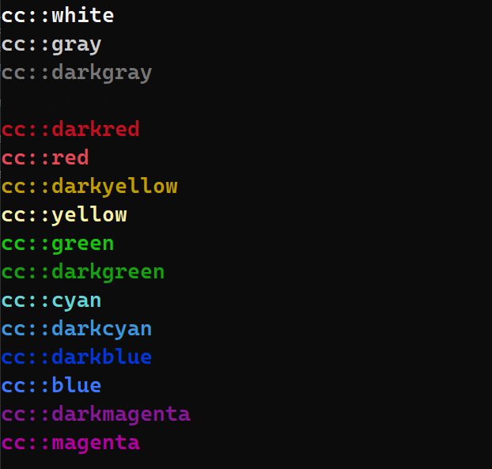

# C++ Colors


## Description

This is a simple header-only library for printing colored text in the terminal.</br>
It is cross-platform and supports both Windows and Unix-like systems.</br>
The library is written in C++11 and uses ANSI escape codes for coloring the text. The library is tested on GCC 13 and MVSC 19.36.

**The library has built-in system for setting default terminal color on application exit.**

## Requirements

- C++11 Compiler
- CMake

## Usage

```cpp
#include <iostream>
#include <colors.hpp>

int main() {
    std::cout << cc::darkred << "Hello, " << cc::red << "World!" << std::endl;
    return 0;
}
```

## Colors


